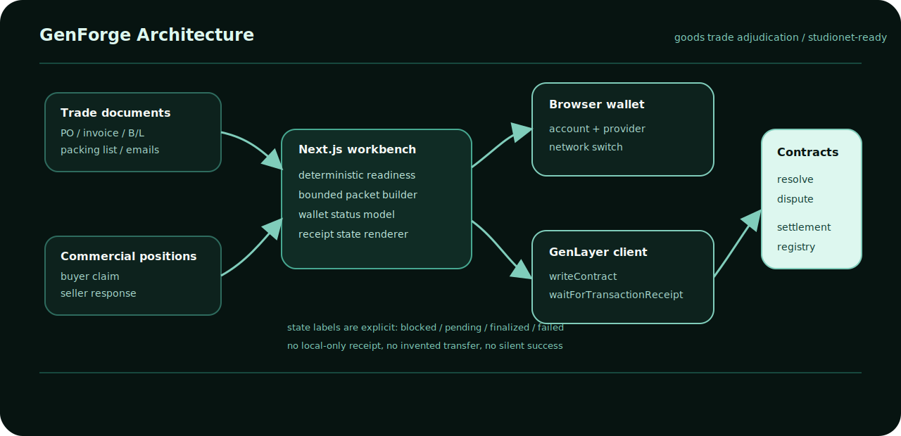
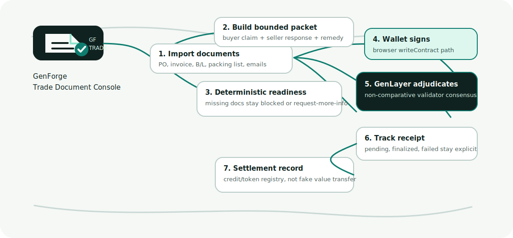

<p align="center">
  
</p>

<h1 align="center">GenForge</h1>

<p align="center">
  <strong>Trade document adjudication on GenLayer</strong><br />
  Goods purchase disputes, commercial evidence packets, wallet-signed contract writes, receipt tracking, and settlement records.
</p>

<p align="center">
  <a href="https://genforge-seven.vercel.app/">Live App</a>
  ·
  <a href="https://docs.genlayer.com/api-references/genlayer-js">GenLayerJS</a>
  ·
  <a href="https://docs.genlayer.com/developers/intelligent-contracts/equivalence-principle">Equivalence Principle</a>
</p>

<p align="center">
  
  
  
  
</p>



## Mission

GenForge is a GenLayer-native command surface for goods-trade disputes. It turns commercial documents into a bounded adjudication packet, sends that packet to a deployed Intelligent Contract, and keeps the wallet, transaction, receipt, and settlement state visible.

The target workflow is not generic AI review. It is trade operations:

- purchase orders and sales contracts
- invoices, bills of lading, packing lists, inspection records
- buyer claims, seller responses, delivery disputes, payment release disputes
- GenLayer validator adjudication for liability, remedy, and request-more-info outcomes
- settlement or service-credit records after an accepted case

## Product Surface

```text
GenForge Workbench
|
+-- Trade Case
|   |
|   +-- Import commercial documents
|   +-- Structure buyer / seller positions
|   +-- Build the bounded adjudication packet
|   +-- Submit the packet to GenLayer after readiness passes
|
+-- Runtime Ops
|   |
|   +-- Show configured network and contract addresses
|   +-- Show browser-wallet readiness
|   +-- Show operator deploy blockers honestly
|
+-- Settlement Token
    |
    +-- Prepare a settlement or credit record
    +-- Sign with the connected wallet
    +-- Write to the configured GenLayer factory
    +-- Track the receipt before claiming finality
```

## Why This Belongs On GenLayer

Traditional smart contracts are good at deterministic rules. Trade disputes are not only deterministic. A purchase order may be clear, but the real decision often depends on messy evidence: delivery context, correspondence, Incoterms, claimed exceptions, short shipment narratives, and whether payment should be released or adjusted.

GenForge separates the work:

| Layer | Responsibility | Why it matters |
| --- | --- | --- |
| Deterministic app | Normalize documents, parties, dates, amounts, and missing fields | Keeps untrusted evidence bounded before contract submission |
| GenLayer Intelligent Contract | Resolve the commercial question with criteria-based validator consensus | Prevents one server or one party from being the sole adjudicator |
| Browser wallet | Signs the write transaction | The user explicitly authorizes the on-chain action |
| Receipt tracker | Reads accepted/finalized/failed transaction state | The UI cannot pretend a case succeeded without network evidence |
| Settlement registry | Records a settlement or credit request | Keeps post-decision settlement state auditable without claiming value transfer |

## On-Chain Proof Map

| Reviewer concern | Code evidence |
| --- | --- |
| Real GenLayer contract exists | `contracts/genforge_judge/resolve_enterprise_dispute.py` |
| Meaningful non-deterministic adjudication | `gl.eq_principle.prompt_non_comparative(...)` in `resolve_dispute` |
| Contract writes state | `@gl.public.write def resolve_dispute(...)` stores `self.resolutions[caseId]` |
| Contract exposes readback | `get_resolution(...)` and `get_resolution_judgment(...)` |
| Frontend writes the submitted contract | `packages/genlayer-client/src/index.ts` calls `writeContract(...)` |
| Frontend tracks real receipt | `waitForTransactionReceipt(...)` is used for submission and refresh paths |
| Wallet is not localStorage simulation | wallet state comes from browser provider account flow |
| Settlement is honest | token factory records settlement metadata; it does not claim GEN or ERC-20 value moved |

OBSERVED: The current browser write path no longer depends on a wallet-specific snap method before transaction submission. Generic browser wallets can connect by account and network-switch methods, then `writeContract(...)` is the signing path.

## Workflow



```text
1. Import
   PO, invoice, bill of lading, packing list, email thread, inspection note

2. Bound
   buyer claim + seller response + requested remedy + evidence summary

3. Gate
   deterministic readiness checks block thin or unsafe packets

4. Sign
   browser wallet signs the GenLayer write transaction

5. Adjudicate
   Intelligent Contract applies non-comparative validator consensus

6. Track
   receipt status remains pending/finalized/failed until verified

7. Settle
   settlement token registry records the accepted trade resolution outcome
```

## How To Use

1. Open `https://genforge-seven.vercel.app/`.
2. Connect a funded browser wallet from the top-right control.
3. Open `Trade Case`.
4. Import or paste the commercial documents and correspondence.
5. Build the case packet.
6. Review readiness and missing evidence.
7. Open the case `Chain` tab.
8. Submit the case on-chain and approve the wallet signature.
9. Refresh the receipt until the result is finalized or fails.
10. Open `Settlement Token` only after the trade case has an accepted settlement basis.

## Tech Stack

```text
Runtime
|
+-- Next.js App Router
+-- React client components
+-- TypeScript strict mode
+-- Vercel production deployment

GenLayer
|
+-- genlayer-js browser client
+-- writeContract / readContract / waitForTransactionReceipt
+-- Python Intelligent Contracts
+-- genvm-linter validation

Quality
|
+-- Vitest UI and SDK tests
+-- deterministic rule tests
+-- direct/integration contract test harness
+-- Hallmark-stamped responsive UI
```

## Repository Map

```text
.
|
+-- apps/
|   +-- web/
|       +-- app/
|       |   +-- page.tsx
|       |   +-- layout.tsx
|       |   +-- globals.css
|       |
|       +-- public/
|       |   +-- genforge-logo.svg
|       |
|       +-- src/
|           +-- components/
|           |   +-- workspace-shell.tsx
|           |   +-- enterprise-dispute-dashboard.tsx
|           |   +-- contract-ops-dashboard.tsx
|           |   +-- token-launch-dashboard.tsx
|           |
|           +-- lib/
|           |   +-- public-genlayer-config.ts
|           |   +-- dispute-domain.ts
|           |
|           +-- test/
|
+-- contracts/
|   +-- genforge_judge/
|       +-- resolve_enterprise_dispute.py
|       +-- deploy_project_token.py
|       +-- review_submission.py
|
+-- packages/
|   +-- genlayer-client/
|   +-- domain/
|   +-- evidence/
|   +-- rules/
|   +-- reports/
|
+-- docs/
|   +-- system-architecture.svg
|   +-- readme-flow.svg
```

## Local Run

```bash
npm install
npm --prefix apps/web run dev
```

## Verification

```bash
npm run lint:genforge
npm run typecheck:genforge
npm run test:genforge
npm run build:genforge
npm run lint:contract
```

Contract harness:

```bash
npm run test:contract:direct
npm run test:contract:integration
```

MANUAL_REVIEW_REQUIRED: `test:contract:direct` currently depends on the local GenLayer test harness behavior on the host OS. On Windows, this workspace has observed a `gltest` temp-file unlink `PermissionError`; contract lint still validates the three contracts.

## Environment

Browser wallet submission:

```bash
NEXT_PUBLIC_GENLAYER_NETWORK=studionet
NEXT_PUBLIC_GENLAYER_RPC_URL=https://studio.genlayer.com/api
NEXT_PUBLIC_GENLAYER_DISPUTE_CONTRACT_ADDRESS=0x...
NEXT_PUBLIC_GENLAYER_TOKEN_FACTORY_ADDRESS=0x...
NEXT_PUBLIC_GENLAYER_TOKEN_FACTORY_METHOD=deploy_token
NEXT_PUBLIC_GENLAYER_TOKEN_FACTORY_READBACK_METHOD=get_token_deployment_json
NEXT_PUBLIC_GENLAYER_STUDIO_URL=https://studio.genlayer.com
```

Optional legacy repository-review route:

```bash
GITHUB_TOKEN=...
NEXT_PUBLIC_GENLAYER_CONTRACT_ADDRESS=0x...
```

Optional operator SDK/deploy path:

```bash
GENLAYER_MODE=sdk
GENLAYER_NETWORK=studionet
GENLAYER_CONTRACT_ADDRESS=0x...
GENLAYER_RPC_URL=https://studio.genlayer.com/api
GENLAYER_PRIVATE_KEY=0x...
GENFORGE_ENABLE_OPERATOR_DEPLOY=true
```

`GENLAYER_PRIVATE_KEY` must remain server-side. Public contract addresses and public RPC values use `NEXT_PUBLIC_*` because browser wallet writes need those values client-side.

## Production Notes

```text
Live app: https://genforge-seven.vercel.app/
Vercel root directory: apps/web
```

Because the app imports monorepo packages from `../../packages/*`, Vercel must include source files outside the root directory.

OBSERVED: Hosted Vercel runtime is not treated as a contract deployment machine. If `/api/ops/genlayer` reports `spawn genlayer ENOENT`, deploy contracts from a secure operator environment with the GenLayer CLI and a funded account, then write the deployed addresses back into Vercel environment variables.

## Truth Boundaries

OBSERVED in repository:

- Trade dispute contract uses `gl.eq_principle.prompt_non_comparative(...)`.
- Browser client uses `writeContract(...)` and `waitForTransactionReceipt(...)`.
- UI uses explicit blocked, pending, finalized, failed, and unavailable states.
- Settlement token factory records a settlement or credit request.

MISSING unless manually verified:

- A live wallet signature from the user's account.
- The account's GEN balance for network fees.
- The final transaction receipt for a specific user-submitted case.
- Explorer/Studio proof for any new deployment address.

## Official References Checked

Checked on 2026-07-19:

- GenLayerJS: `https://docs.genlayer.com/api-references/genlayer-js`
- Writing Data to Intelligent Contracts: `https://docs.genlayer.com/developers/decentralized-applications/writing-data`
- Non-determinism: `https://docs.genlayer.com/developers/intelligent-contracts/features/non-determinism`
- Equivalence Principle: `https://docs.genlayer.com/developers/intelligent-contracts/equivalence-principle`
- Tooling setup: `https://docs.genlayer.com/developers/intelligent-contracts/tooling-setup`

## Limitations

- Binary imports such as PDF, DOCX, XLSX, PNG, and JPG are tracked as evidence requiring manual review; the browser does not pretend to OCR or fully parse them.
- Settlement records are registry entries. They are not represented as confirmed value transfers.
- The legacy GitHub submission review route remains in the repository, but the primary product is goods-trade document adjudication.
- On-chain proof requires a real wallet signature, fees, and a final GenLayer receipt.
